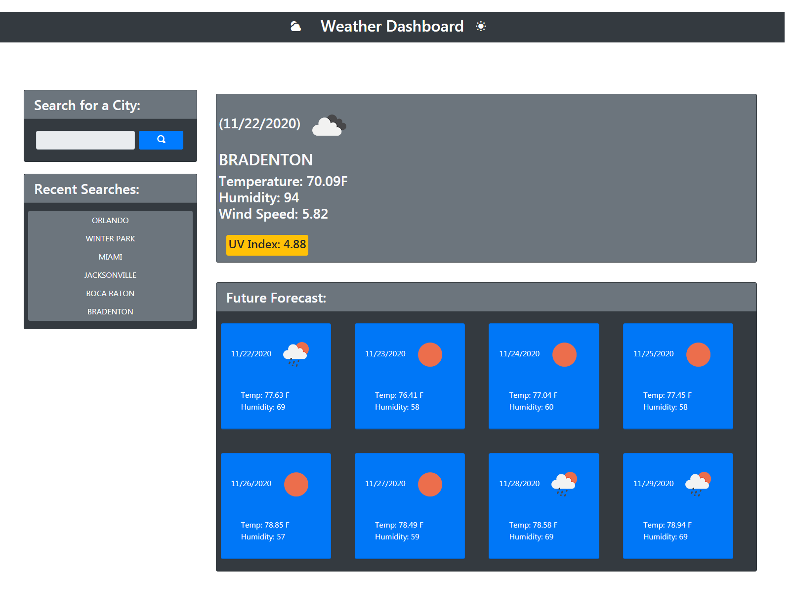

# Weather Dashboard
### UCF Coding Boot Camp Week 6 Challenge

## Purpose
Provides an application to retrieve weather data for cities desired upon search. Weather Dashboard displays current data of searched city at the time of inquiry as well as a forecast. 

## Instructions
* To utilize the application, an API key is required for production to work from OpenWeather API. User will need to create a free account for a key to be provided at no cost.
* If user is not able to recieve API key, they are able to contact Wendy Lemus for assistance.
* API key must be applied to JavaScript logic to funtion properly. Once established, user can proceed. 
1.  Deploy production.
2. Once loaded, user will be able to type in the desired city inquiry in the input form under "Search for a City:". 
3. User must click on the blue button with an icon of a magnifying glass, next to input field, in order to submit search inquiry. 
4. Results will display on page accordingly. 
5. User may follow the same procedure from step 2 and on in order to make a new search inquiry. 

## Features
* Displays cities current temperature, humidity, wind speeds, UV index and and icon representation of weather.
* UV index presents with a color indicator of whether conditions are favorable (green), moderate (yellow) or severe (red).
* Displays a future forecast for the following 8 days of searched city. Displays the daily information for forecasted dates to include the date, temperature, humidity and an icon representation of weather. 
* Previously searched cities data will persist under "Recent Searches" and can be again presented with current and future conditions for that city once the user clicks on city button.

## Deployed Production Link
[weather-dashboard](https://elysiayn.github.io/weather-dashboard/)

 

### Contributions 
HTML, JavaScript, and CSS written by Wendy Lemus. 